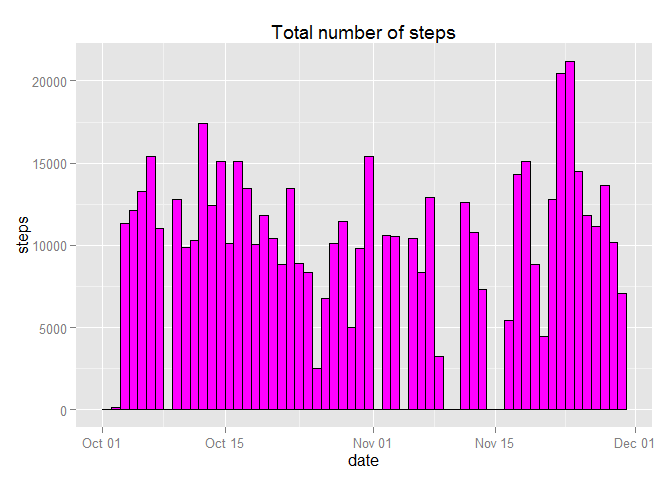
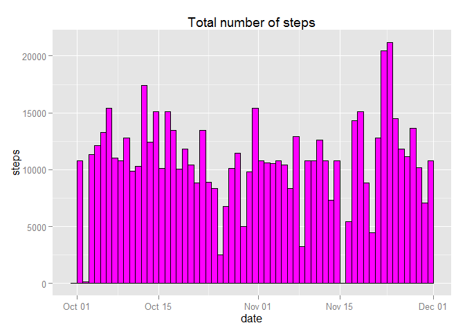

# Reproducible Research: Peer Assessment 1


## Loading and preprocessing the data

```r
unzip("activity.zip")
activity = read.csv("activity.csv")
activity$date = as.Date(activity$date)
summary(activity)
```

```
##      steps            date               interval   
##  Min.   :  0.0   Min.   :2012-10-01   Min.   :   0  
##  1st Qu.:  0.0   1st Qu.:2012-10-16   1st Qu.: 589  
##  Median :  0.0   Median :2012-10-31   Median :1178  
##  Mean   : 37.4   Mean   :2012-10-31   Mean   :1178  
##  3rd Qu.: 12.0   3rd Qu.:2012-11-15   3rd Qu.:1766  
##  Max.   :806.0   Max.   :2012-11-30   Max.   :2355  
##  NA's   :2304
```

## What is mean total number of steps taken per day?

```r
totalSteps = aggregate(steps ~ date, data = activity, FUN = sum, na.rm = T)
mean(totalSteps$steps)
```

```
## [1] 10766
```

```r
median(totalSteps$steps)
```

```
## [1] 10765
```

```r
library(ggplot2)
ggplot(totalSteps, aes(x = date, weight = steps)) + 
  geom_bar(colour = "black", fill = "magenta", binwidth = 1) +
  ylab("steps") +
  ggtitle("Total number of steps") 
```

 

## What is the average daily activity pattern?

```r
library(dplyr, warn.conflicts = FALSE)
meanStepsByInterval = activity %>% tbl_df() %>% group_by(interval) %>% summarise(mean_steps = mean(steps, na.rm = TRUE))

ggplot(meanStepsByInterval, aes(x = interval, y = mean_steps)) + geom_line() + ggtitle("Average number of steps by interval")
```

 

```r
meanStepsByInterval$interval[which.max(meanStepsByInterval$mean_steps)]
```

```
## [1] 835
```

## Imputing missing values

```r
sum(!complete.cases(activity))
```

```
## [1] 2304
```

```r
activity_complete = activity
indices = which(is.na(activity$steps))

NAs = subset(activity, subset = is.na(steps), select = c("interval", "steps"))
activity_complete$steps[indices] = meanStepsByInterval$mean_steps[match(activity$interval[indices], meanStepsByInterval$interval)]

totalStepsComplete = aggregate(steps ~ date, data = activity_complete, FUN = sum)
mean(totalStepsComplete$steps)
```

```
## [1] 10766
```

```r
median(totalStepsComplete$steps)
```

```
## [1] 10766
```

```r
library(ggplot2)
ggplot(totalStepsComplete, aes(x = date, weight = steps)) + 
  geom_bar(colour = "black", fill = "magenta", binwidth = 1) +
  ylab("steps") +
  ggtitle("Total number of steps")
```

 

We can see that there is no effect of imputing on mean and median because we were imputing using the mean values for each of the intervals.

## Are there differences in activity patterns between weekdays and weekends?

```r
activity_complete$typeOfDay = factor(sapply(weekdays(activity_complete$date), 
       function(x) {
         if (x %in% c("Saturday", "Sunday")) return("weekend")
         return("weekday")
       }))

meanStepsByInterval = activity_complete %>% tbl_df() %>% group_by(interval, typeOfDay) %>% summarise(mean_steps = mean(steps, na.rm = TRUE))

ggplot(meanStepsByInterval, aes(x = interval, y = mean_steps)) + 
  facet_grid(facets = typeOfDay ~ .) + 
  geom_line() + 
  ggtitle("Average number of steps by interval")
```

 

```r
ggplot(meanStepsByInterval, aes(x = interval, y = mean_steps, color = typeOfDay)) + 
  geom_line() + 
  ggtitle("Average number of steps by interval")
```

 
